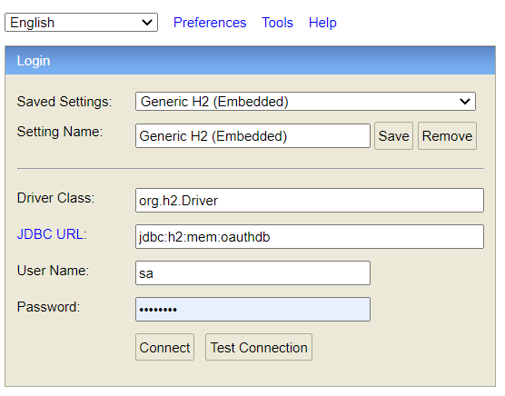

# Pipedrive Integration Sample Application

A sample Java & Spring Boot application to provide integration with Pipedrive which is CRM platform for companies.
With this application, sample use case implemented via calling Pipedrive authorization and call-log service end points.

## Requirements
* Java 17
* Spring Boot 2.7.8
* Spring Security
* Spring Data
* Gradle
* H2 Database
* Flyway Database Migration Tool
* Wiremock
* Postman
* Pipedrive account (To enable API services)
* Pipedrive API services
* REST/JSON
* An IDE or text editor (Intellij or Eclipse)

## Execution Steps
* Clone GitHub repository
* Build project
* Download dependencies
* Run Application.java class
* Application will be started on localhost 8080 port http://localhost:8080.
* To reach postman collection visit [here](postman-collection-onoff.postman_collection.json)
* Except API end points and H2 console url API returns 403 error.
* End points are covered with Basic Authentication(user:password).
* When application is started, two database table will be created with Flywaydb.
* Database URL can accessible. You can check database -> http://localhost:8080/h2-console
  * To access database provide details from [application.properties](src%2Fmain%2Fresources%2Fapplication.properties):
    * 

## API Definitions
* http://localhost:8080/setup/auth
  1. This api creates and deletes user auth credentials regarding provided request body. If user is already exist it returns 400 Bad Request.
  For more details please check api collection.
* http://localhost:8080/pipedrive/call-log
  1. API creates call log record with checking user's token whether they valid or not. 
  If token is expired it sends request to https://oauth.pipedrive.com/oauth/token end point.
  And updates user credentials. After updating user credential it sends request to Pipedrive call-log service to create call-log.
* http://localhost:8080/pipedrive/call-log?userId={userId}
  1. This api returns call log list from our database by taking userId as parameter.
* https://oauth.pipedrive.com/oauth/token
  1. Returns token values from Pipedrive regarding user.
* https://onoff-demo-sandbox.pipedrive.com/v1/callLogs
  1. Returns call-logs which are created in Pipedrive server.
